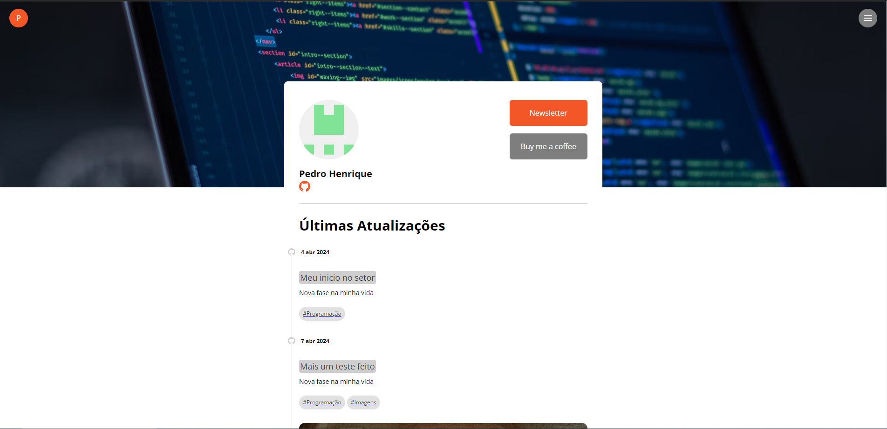
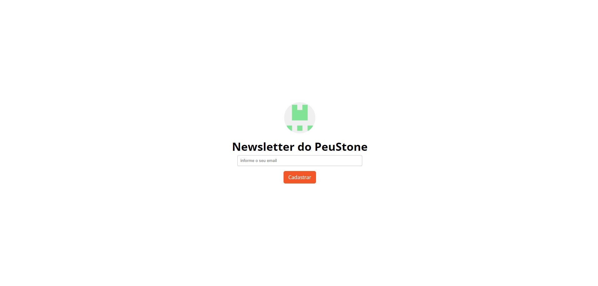

# Projeto Next-FullStack

Projeto desenvolvido durante o curso de NextJs: fullstack com lambdas

# Principais tecnologias utilizadas no projeto

* NextJs
* Typescript
* NodeJs
* Styled-Components
* Supabase
* SendGrid

# Imagens do projeto

Pagina Inicial

Pagina de Newsletter

